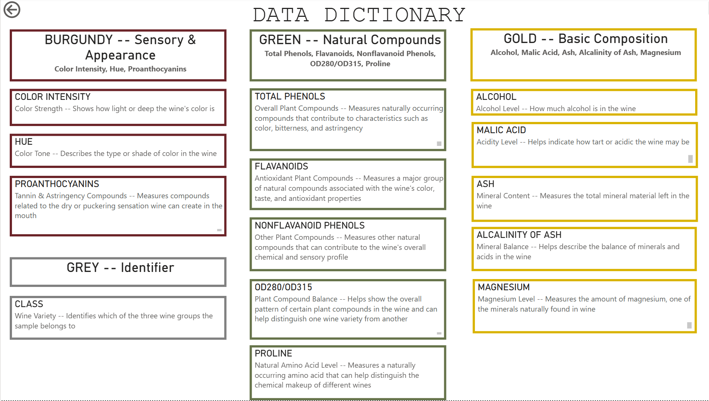
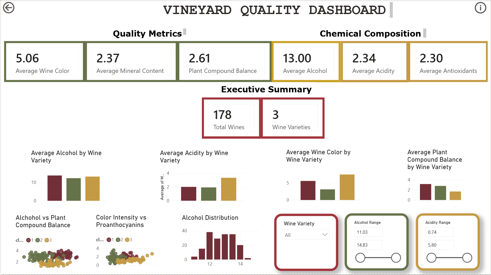
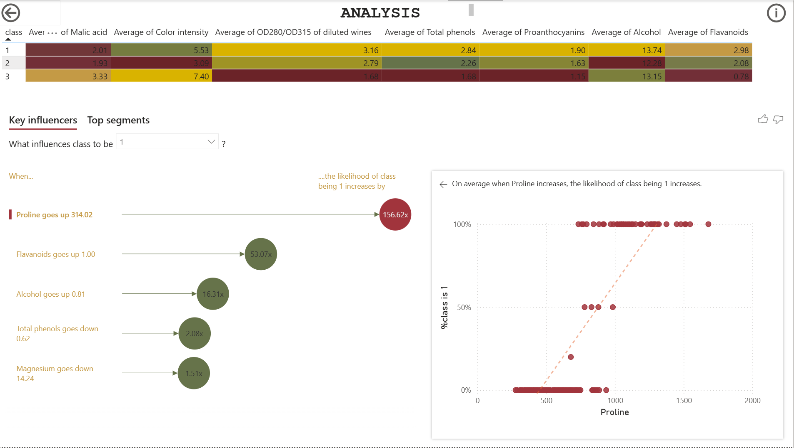
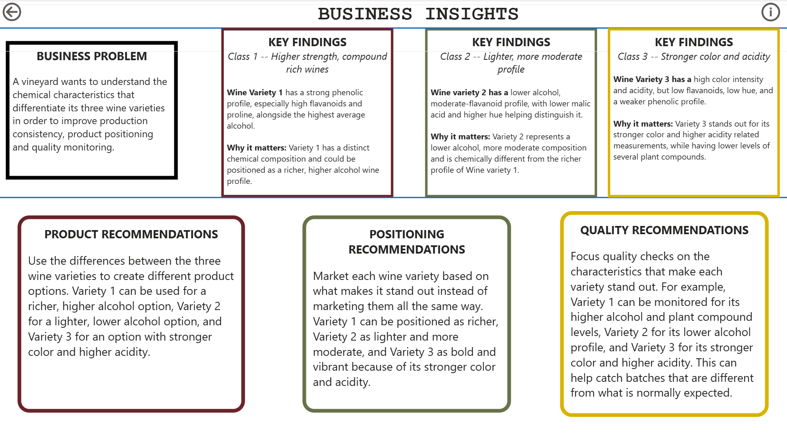

# 🍷 Vineyard Quality Dashboard

**Power BI | Data Analysis | Business Intelligence | Product Strategy**

An interactive Power BI dashboard analyzing 178 wine samples across three wine varieties to understand what differentiates each variety and turn those differences into product, positioning, and quality recommendations.

## Business Problem

A vineyard wants to better understand the characteristics that differentiate its three wine varieties.

The goal of this project was to analyze those differences and determine how the findings could support:

- Product differentiation
- Market positioning
- Quality monitoring
- More data driven production decisions

## Dataset

The dataset contains **178 wine samples across three wine varieties** and includes measurements related to:

- Alcohol and acidity
- Color characteristics
- Mineral composition
- Natural plant compounds
- Tannin related compounds
- Other chemical characteristics

Because many of the original variables use technical terminology, I also created a **Data Dictionary** that translates the measurements into more business-friendly language.

## Dashboard

I built an interactive Power BI dashboard that allows users to compare the three wine varieties and explore how their characteristics differ.

The dashboard includes:

- KPI cards summarizing major quality and composition metrics
- Wine variety filtering
- Alcohol and acidity range filters
- Variety level comparison charts
- Alcohol distribution analysis
- Scatterplots showing relationships between important characteristics
- Key Influencers analysis
- Business recommendations

## Analysis

I used Power BI's **Key Influencers** analysis along with comparative visualizations to identify which characteristics most strongly distinguish the three wine varieties.

The analysis showed that the varieties have noticeably different profiles rather than behaving like one uniform product group.

## Key Findings

### Wine Variety 1 — Richer, Higher-Alcohol Profile

Variety 1 stands out for its higher alcohol level and higher levels of several naturally occurring plant compounds.

**Why it matters:**  
This gives the vineyard a way to differentiate Variety 1 as the richer and more full-bodied option within the portfolio rather than positioning all three wines similarly.

### Wine Variety 2 — Lighter, More Moderate Profile

Variety 2 has a lower alcohol level and a more moderate overall composition compared with Variety 1.

**Why it matters:**  
This creates an opportunity to position Variety 2 toward customers looking for a lighter or more moderate wine option and gives the vineyard a distinct product segment.

### Wine Variety 3 — Stronger Color and Higher Acidity

Variety 3 stands out through its stronger color and higher acidity while showing lower levels of several plant compounds.

**Why it matters:**  
Its distinct appearance and acidity profile provide another point of differentiation and can help the vineyard position it separately from the richer Variety 1 and lighter Variety 2.

## Business Recommendations

### Product Strategy

Use the differences between the three varieties to create clearly differentiated product options instead of treating them as similar wines.

- **Variety 1:** richer, higher alcohol option
- **Variety 2:** lighter, lower alcohol option
- **Variety 3:** stronger color, higher-acidity option

### Positioning Strategy

Market each wine around the characteristics that make it stand out.

This gives each variety a clearer role within the vineyard's portfolio and reduces overlap between the three products.

### Quality Monitoring

Instead of applying exactly the same quality expectations to every variety, monitor each wine against the characteristics that normally define its profile.

For example:

- Variety 1 → alcohol and plant compound profile
- Variety 2 → lower alcohol profile
- Variety 3 → color strength and acidity

Large deviations from these expected profiles could help flag batches for further review.

## Tools & Skills

**Tools**
- Power BI
- Power Query
- Excel

**Analysis**
- Data cleaning and transformation
- Exploratory data analysis
- KPI development
- Comparative analysis
- Key Influencers analysis
- Data visualization

**Business Intelligence**
- Dashboard design
- Product segmentation
- Business insight development
- Product positioning
- Quality monitoring
- Translating technical data for nontechnical audiences

## Repository Contents

- `Vineyard Quality Dashboard.pbix` — Power BI dashboard
- `Wine dataset.csv` — Source dataset
- `images/` — Dashboard and analysis screenshots
- `README.md` — Project case study

## Project Outcome

This project demonstrates how product data can be transformed into actionable business insights. Rather than only reporting differences between the wines, the dashboard connects those differences to decisions around **product strategy, positioning, and quality monitoring**.
